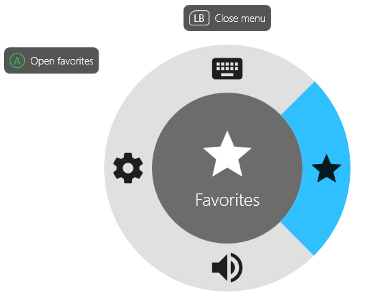
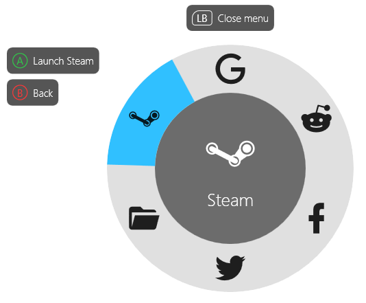
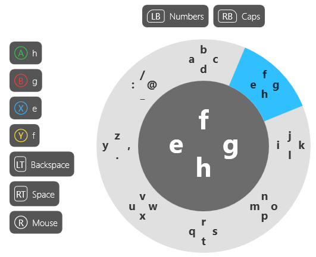

# GamepadMapper

.NET implementation of [Gopher360](https://github.com/Tylemagne/Gopher360), with an aim of being customizable and offering an OSD assistant.

# Features

- Versatile [configuration](https://github.com/EdonGashi/gamepad-mapper/blob/master/src/GamepadMapper/config.txt).
- Mod key support, which doubles available button bindings.
- Key combinations, macros, and commands.
- Live configuration editing.
- Multiple profiles with live switching.
- [Customizable](https://github.com/EdonGashi/gamepad-mapper/blob/master/src/GamepadMapper/menu_main.txt) radial menu.
- Radial keyboard built entirely in [config](https://github.com/EdonGashi/gamepad-mapper/blob/master/src/GamepadMapper/menu_keyboard.txt).

Main menu:

Keyboard:

# Default profile

Key|Function|Comment
---|---|---
A|Map LBUTTON|Button acts as a left mouse button.
B|Press ESCAPE, hold ALT+F4|
X|Press ENTER, hold repeat|
Y|Map RBUTTON|Button acts as a right mouse button.
DPadLeft|Press LEFT, hold repeat|
DPadUp|Press UP, hold repeat|
DPadRight|Press RIGHT, hold repeat|
DPadDown|Press DOWN, hold repeat|
LB|Show menu|Displays radial menu.
RB|MOD|When holding MOD other buttons have alternate functions.
LT|Press BACKSPACE, hold repeat|Repeat rate is affected by pressure.
RT|Press SPACE, hold repeat|Repeat rate is affected by pressure.
LSB|Map MBUTTON|Left stick click acts as a middle mouse button.
RSB|Press HOME|
Back|Press CTRL+ALT+TAB, hold ALT+TAB|Press back and use arrows to navigate, X to confirm, B to cancel.
Start|Press WINKEY, hold WINKEY+D|WINKEY+D minimizes all windows.

The keys have different functions when MOD button is pressed:

Key|Function|Comment
---|---|---
ModA|Map LBUTTON|Same as A to avoid confusion.
ModB|Press DELETE, hold repeat|
ModX|Press CTRL+TAB, hold CTRL+SHIFT+TAB|Browser next tab and previous tab.
ModY|Press CTRL+T, hold CTRL+W|Open and close browser tabs.
ModDPadLeft|Press ALT+LEFT, hold repeat|Browser back, VLC jump back.
ModDPadUp|Press VOLUME_UP, hold repeat|
ModDPadRight|Press ALT+RIGHT, hold repeat|Browser forward, VLC jump forward.
ModDPadDown|Press VOLUME_DOWN, hold repeat|
ModLB|Show keyboard|Displays radial keyboard.
ModRB|N/A|
ModLT|Press CTRL+Z, hold repeat|Repeat rate is affected by pressure.
ModRT|Press CTRL+Y, hold repeat|Repeat rate is affected by pressure.
ModLSB|Map MBUTTON|Same as LSB to avoid confusion.
ModRSB|Press END|
ModBack|Press F, hold BROWSER_REFRESH|F toggles full-screen in Youtube and VLC.
ModStart|Press WINKEY+E, hold CTRL+SHIFT+ESCAPE|Open explorer/open task manager.

Back+Start combination enables/disables processing input. This gesture cannot be modified in configuration.

# Credits

- [Radial Menu UI](https://dribbble.com/shots/801609-Concept-Idea-Radial-Menu-UI-animated) by Howard Moen for radial menu design.
- [speps/XInputDotNet](https://github.com/speps/XInputDotNet) for XInput handling.
- [michaelnoonan/inputsimulator](https://github.com/michaelnoonan/inputsimulator) for keyboard and mouse simulation.
- [TChatzigiannakis/InputSimulatorPlus](https://github.com/TChatzigiannakis/InputSimulatorPlus) for enhanced version of InputSimulator.
- [MahApps/MahApps.Metro.IconPacks](https://github.com/MahApps/MahApps.Metro.IconPacks) for icon packs, and [Templarian/MaterialDesign](https://github.com/Templarian/MaterialDesign) for the material icons. 
